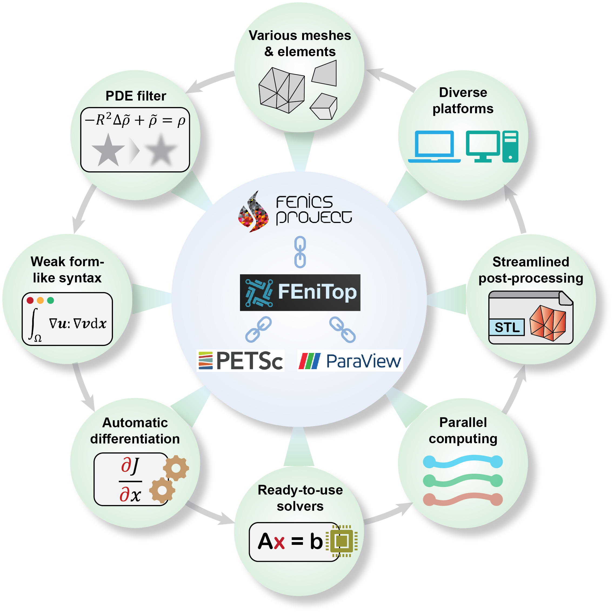
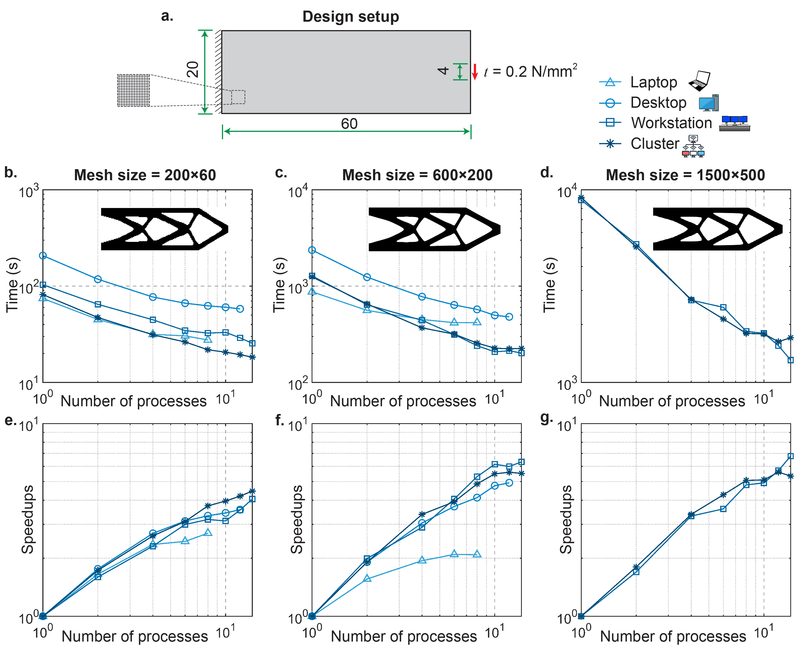
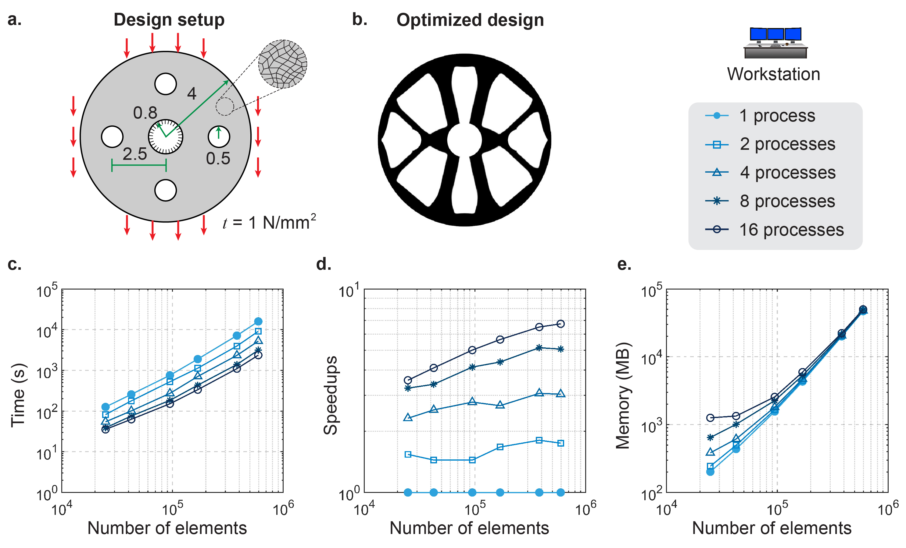
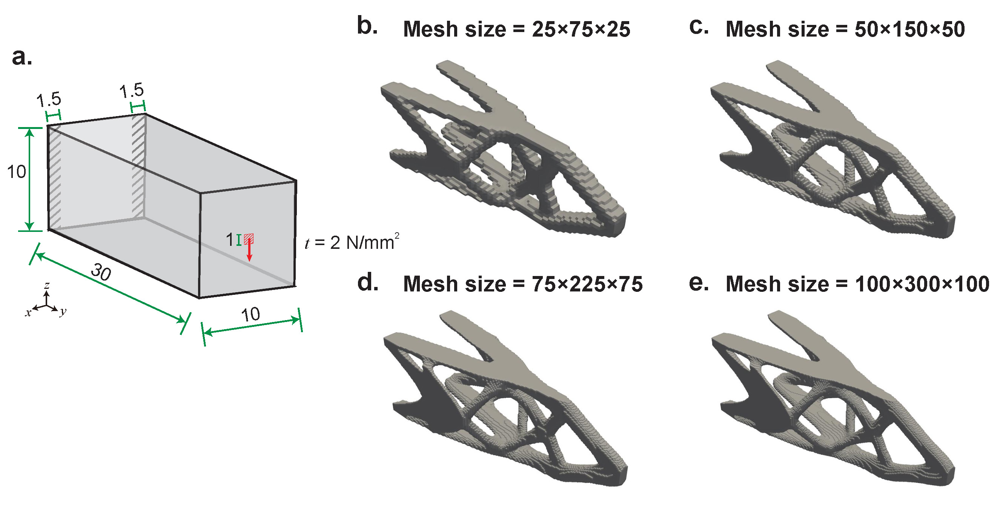
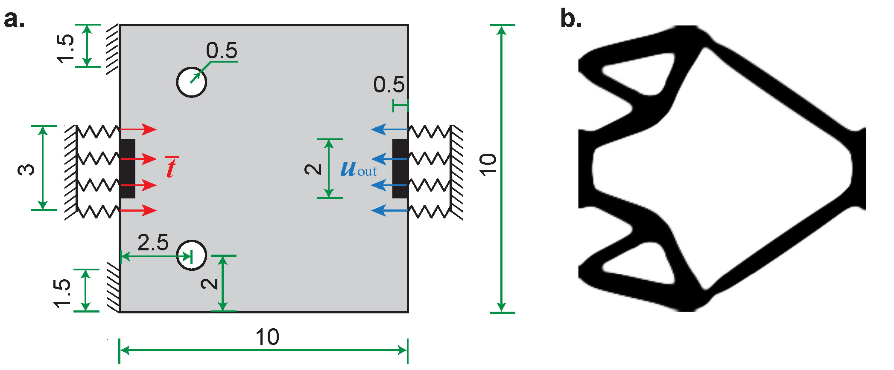

# FEniTop
FEniTop (pronounced as /ˈfi nɪ tɒp/) is short for [FEniCSx](https://fenicsproject.org)-based [topology optimization](https://www.sciencedirect.com/science/article/pii/0045782588900862).

It is an open-source topology optimization software inheriting several advantages of FEniCSx including
- seamless transitions to varying **spatial dimensions** (2D and 3D), **mesh geometries** (structured and unstructured), **element geometries** (e.g., triangles, quadrilaterals), [**element types**](https://docs.fenicsproject.org/basix/main/) (e.g., Lagrange, Crouzeix–Raviart), **element orders**, and **quadrature degrees**;
- the expression of PDEs in **weak form**, bypassing the need for tedious matrix manipulation;
- the **automatic differentiation** that can mitigate the intricacies of chain rules in FEA and sensitivity analysis;
- the access to readily available **[linear](https://petsc.org/release/manualpages/KSP/KSPType) and nonlinear solvers** and [**preconditioners**](https://petsc.org/release/manualpages/PC/PCType) through the [PETSc](https://petsc.org/release) backend via [petsc4py](https://petsc.org/main/petsc4py);
- scalable **parallel computing** support compatible with **various platforms** from laptops to distributed computing clusters.

Additionally, it features
- a [**Helmholtz-type PDE filter**](https://onlinelibrary.wiley.com/doi/full/10.1002/nme.3072) tailored for large-scale problems in parallel computing, particularly emphasizing its efficacy for large filter radii;
- parallel implementations for both the [**Optimality Criteria (OC) optimizer**](https://www.sciencedirect.com/science/article/pii/S004579499800131X) and the [**Method of Moving Asymptotes (MMA)**](https://onlinelibrary.wiley.com/doi/abs/10.1002/nme.1620240207) to update the design variables;
- exporting optimized designs into [XDMF](https://www.xdmf.org/index.php/Main_Page) files, enabling seamless importation into open-source ParaView software for post-processing.



# Examples with performance tests

**2D cantilever beam with a structured mesh**



**2D disk with an unstructured mesh**



**3D cantilever beam with a structured mesh**



**3D shell with an unstructured mesh**


**2D compliant mechanism design**



# How to access FEniTop

### Installation of the coding environment
FEniTop relys on the coding evironment of FEniCSx and a few other dependencies.
To install the coding environment, we can follow the procedure below.

#### Short version

- Install [FEniCSx](https://github.com/FEniCS/dolfinx) of version 0.7.3.
- Install [PyVista](https://github.com/pyvista/pyvista).
- Install Xvfb with `apt-get -qq update && apt-get -y install libgl1-mesa-dev xvfb`.

#### Detailed version

To install the coding environment in one shot, we recommend to use [Docker](https://www.docker.com/) containers. Take Windows 11 as an example, we can follow the steps below.

- Run `wsl --install` in Windows PowerShell, which automatically enables the features necessary to run [Windows Subsystem for Linux (WSL)](https://learn.microsoft.com/en-us/windows/wsl/install) and installs the Ubuntu distribution of Linux.
- Install [Docker Desktop](https://www.docker.com/products/docker-desktop) and [Visual Studio Code](https://code.visualstudio.com/).
- Start Docker Desktop, select `settings`-`Resources`-`WSL integration`, and activate Ubuntu we just installed if not activated.
- Start Ubuntu and run `docker pull jiayingqi/dolfinx-fenitop`, which pulls an image containing all required packages (FEniCSx+PyVista+Xvfb).
- Use the pulled image to create a Docker container by running `docker run -it --name fenitop_container --shm-size=1024m -v /mnt/d/windows_folder_name:/shared jiayingqi/dolfinx-fenitop` in Ubuntu. Change `d` to the actual disk and change `windows_folder_name` to the acutual folder.
- Start Visual Studio Code and select `Extensions` (`Ctrl`+`Shift`+`X`). Search for and install `Docker` and `Remote Development` extensions.
- Select `Docker` extension we just installed, and we should see a container named as `fenitop_container`. Right click on this container and select `Start` and then `Attach Visual Studio Code`.
- A new window will pop up. In this window, select `File`-`Open Folder` (`Ctrl`+`K` and then `Ctrl`+`O`) and open the `shared` folder.
- Now we have successfully created the coding environment inside this folder. A good thing is whatever changes you make in this `shared` folder will be synchronized to `windows_folder_name` and vice versa.

### Installation of FEniTop
To install FEniTop, simply execute the command in your terminal (such as the terminal of Visual Studio Code).
```
git clone https://github.com/missionlab/fenitop
```

### How to run FEniTop scripts
To run FEniTop scripts, simply execute the following commands in your terminal.

- 2D cantilever beam with a structured mesh: `mpirun -n 8 python3 scripts/beam_2d.py`
- 2D disk with an unstructured mesh: `mpirun -n 8 python3 scripts/disk_2d.py`
- 3D cantilever beam with a structured mesh: `mpirun -n 8 python3 scripts/beam_3d.py`
- 3D shell with an unstructured mesh: `mpirun -n 8 python3 scripts/shell_3d.py`
- 2D compliant mechanism design: `mpirun -n 8 python3 scripts/mechanism_2d.py`

## Authors, sponsors, and citation

### Authors
- Yingqi Jia (yingqij2@illinois.edu)
- Chao Wang (chaow4@illinois.edu)
- Xiaojia Shelly Zhang (zhangxs@illinois.edu)

### Sponsors
- U.S. National Science Foundation (NSF) EAGER Award CMMI-2127134
- U.S. Defense Advanced Research Projects Agency (DARPA) Young Faculty Award (N660012314013)
- NSF CAREER Award CMMI-2047692
- NSF Award CMMI-2245251

### Citation
- Jia, Y., Wang, C. & Zhang, X.S. FEniTop: a simple FEniCSx implementation for 2D and 3D topology optimization supporting parallel computing. Struct Multidisc Optim 67, 140 (2024). https://doi.org/10.1007/s00158-024-03818-7

```
@article{jia_fenitop_2024,
  title = {{FEniTop}: A Simple {FEniCSx} Implementation for {2D} and {3D} Topology Optimization Supporting Parallel Computing},
  shorttitle = {FEniTop},
  author = {Jia, Yingqi and Wang, Chao and Zhang, Xiaojia Shelly},
  year = {2024},
  month = aug,
  journal = {Structural and Multidisciplinary Optimization},
  volume = {67},
  number = {140},
  issn = {1615-1488},
  doi = {10.1007/s00158-024-03818-7},
}
```
